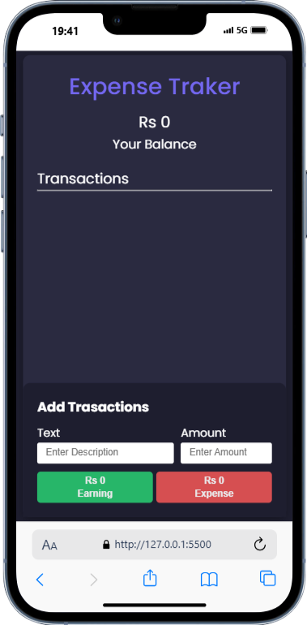

**💸 Expense Tracker App**

A modern, mobile-responsive **Expense Tracker App** built with **HTML, CSS, and JavaScript**. 
It allows users to manage their personal finances by tracking income and expenses in a clean, dark-themed UI.

📸 Preview

 <!-- Replace with actual image if available -->

**✨ Features**

- ✅ Add new transactions with description and amount
- ✅ Mark transactions as **Earning (Credit)** or **Expense (Debit)**
- ✅ Automatically calculates:
  - Net Balance
  - Total Earnings
  - Total Expenses
- ✅ Edit or Delete any transaction
- ✅ Responsive layout for mobile and desktop
- ✅ **Dark Mode Toggle** 🌙 / ☀️
- ✅ Form validation to prevent empty submissions
- ✅ Smooth and modern UI using custom CSS variables

**🚀 Live Demo**

Click here to view the live version: (https://your-live-link.com)  

**🛠️ Built With**

- HTML5
- CSS3 (Custom Variables, Flexbox, Responsive)
- JavaScript (Vanilla)

